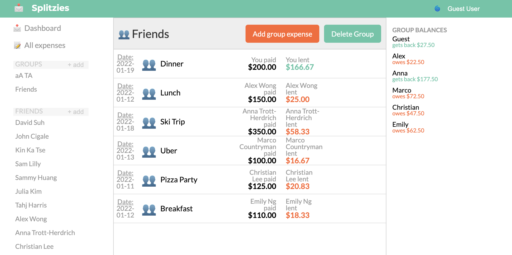

<h1 align ="center">Splitzies<h1>
<p align="center"></p>

# Table of Contents

1. [About Splitzies](#about)
2. [Technology Utilized](#technology)
3. [Balance Update](#balance)
3. [Friends and Group](#friends&groups)
4. [Relevant Code](#code)
        


## About Splitzies <a name="about"></a>

* Visit site [here](http://splitzies.herokuapp.com/#/)

<p>Splitzies is a clone of an expense splitting website called Splitwise. With Splitzies, you are able to add friends and add expenses where either you or one of your friends paid.Splitzies will udpate your account showing your total balance, how much you owe in total as well as how much you are owed. On the dashboard, it sorts the friends you owe money to on the left and friends who owe you money on the right. With a simple click of a button, it will take you to that friends page where every expense with that friend is listed regarding information about that expense such as the date the expense took place, the description, the total amount and how much you are owed or owe. When you click on that expense, it will display further information such as all the people who were invovled in that expense. Site dynamically updates when an expense is added or deleted and updates all the relevation information.</p>


## Teachnology Utilized <a name="technology"></a>

* React
* Redux
* Rails
* Javascript
* Ruby


## Balance Update <a name="balance"></a>

<p align ="center"></p>
<p>Updating balance seemlessly was one of the main features that I wanted to implement. When a user adds an expense, it should not only update accounts with that friend, but also update the logged in users overall balances. This was achieved through fetching expenses from the backend and have them filter out where the current user's ID was invovled as a splitter. Initially, I planned to go through the current user and check the expenses for that user. This was unsuccesful because when an expense is added, it changes the exepenses slice of state. Thus, the user information is not being updated at that point. Since when an expense is created, ajax request is simultaneously being sent to "post" that expense along with the "post" request for all the users associated with it to the joins table. All of these returns an expense which is then sent to the reducer to update the expense slice of state. </p>

<p align ="center"></p>
<p>When you click on an expense, information about all the users involved and how much they owed are displayed.</p>

## Friends & Groups <a name="friends&groups"></a>
<p>Users are able to add friends who are signed up on the site. The friends will show up on the dashboard if a user owes that friend or vice versa. Clicking on the friends name on the list will take them to the friends page where all expenses where have unsettled balances will show up.</p>
 <p>Users can add their friends to a group and can add an expense specifically for that group. Groups page will show all the expenses for that group and on the right cosole, all the members and their balance relative to that group is displayed.
</p>
 <p align ="center"></p>
        
## Relevant Code <a name="code"></a>

<p> In order to calculate overall balance with a specific friend, I grabbed the ID from the url, filtered only the expenses where either the current user was the payer and the friend was involved or where the friend paid and the current user was invovled. Then with some quick javascript math, if current user was payer, I added to the total balance by dividing the total amount by the number of splitters invovled with that expense, else, subtract from the total balance.  </p>

```

        const friend = this.props.users[this.props.match.params.friendId]
        const relatedExpenses = this.props.expenses.filter(expense => (expense.payer_id === friend.id && expense.splitterIds.includes(this.props.currentUser.id)) || (expense.payer_id === this.props.currentUser.id && expense.splitterIds.includes(friend.id)))

        
        let relativeBlance = 0;
        for (const expense of relatedExpenses) {
            const split = expense.amount / expense.splitterIds.length
            if (expense.payer_id === this.props.currentUser.id) {
                relativeBlance += split
            } else {
                relativeBlance -= split
            }
        };

        relativeBlance = relativeBlance.toFixed(2);

        const balanceDiv = relativeBlance >= 0 ? 
            <div className="bal-rel-div"><span id="you-owe-me-money">{friend.name} owes you ${relativeBlance}</span></div> : 
            <div className="bal-rel-div"><span id="i-owe-you-money">You owe {friend.name} ${(relativeBlance * -1).toFixed(2)}</span></div>;
        
       
```
